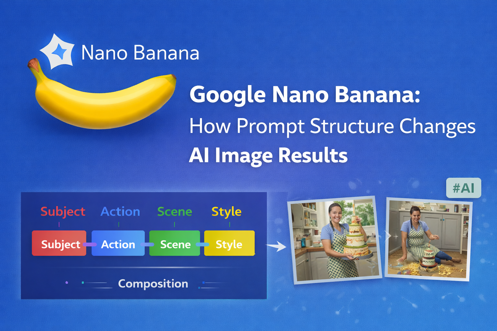

  

**Ashwin** is a passionate developer with expertise in **AI/ML**, **Data Science**, and **Full-Stack Development**.

He loves building innovative projects that solve real-world problems. From crop yield prediction systems to AI-powered dashboards, Ashwin enjoys exploring the intersection of technology and practical applications. He is always eager to learn new technologies and contribute to open-source projects.

To learn more about Ashwin's work, explore the repositories below! 👇

  

  <a href="https://dev.to/ashwin_mehta/google-nano-banana-how-prompt-structure-changes-ai-image-results-488l"
     title="Google Nano Banana: How Prompt Structure Changes AI Image Results">
    <strong>Google Nano Banana: How Prompt Structure Changes AI Image Results</strong>
  </a>

  

    <strong>Published on:</strong> 30th December 2025
     
    In this blog, I explore how structured prompting significantly improves AI-generated image results using Google’s Nano (Nano Banana 🍌) model. I break down a simple 5-step prompt framework—Subject, Action, Scene, Style, and Composition—and show how action-based prompts unlock better reasoning and storytelling in AI systems.
    <a href="https://dev.to/ashwin_mehta/google-nano-banana-how-prompt-structure-changes-ai-image-results-488l">
      read more
    </a>
  

 

