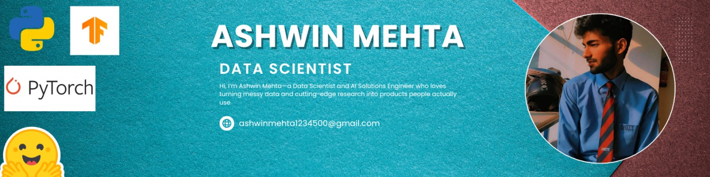
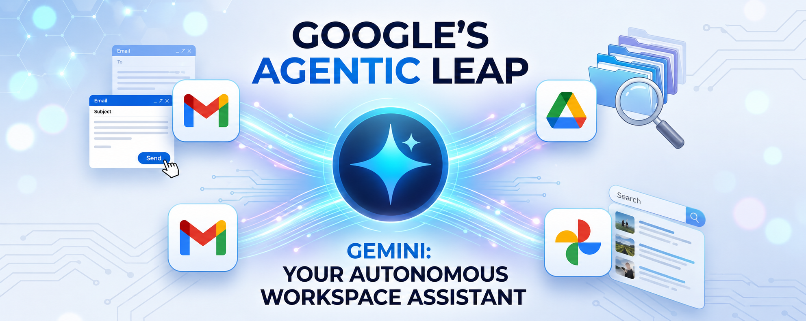
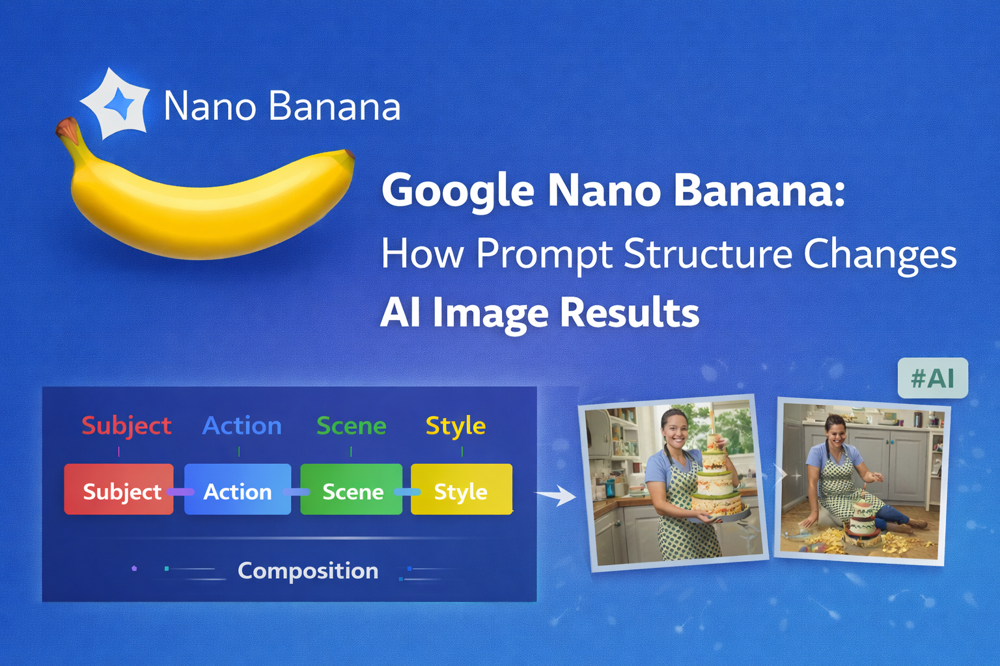

  

**Ashwin** is a passionate Data Scientist and AI Solutions Engineer with expertise in **Generative AI**, **Agentic Systems**, and **MLOps**.

He specializes in building scalable, real-world AI solutions that push the boundaries of machine reasoning. From orchestrating autonomous multi-agent workflows using LangGraph and Gemini to deploying robust CI/CD pipelines on Google Cloud, Ashwin turns cutting-edge research into practical tools. As a Google Student Ambassador and SpaceTech enthusiast, he is always eager to explore the intersection of advanced AI and space exploration while contributing to the open-source community.

To learn more about Ashwin's work, explore the repositories below! 👇

  

   

  <a href="https://dev.to/ashwin_mehta/googles-agentic-leap-how-gemini-turned-workspace-into-your-autonomous-executive-assistant-2nbl"
     title="Google's Agentic Leap: How Gemini Turned Workspace Into Your Autonomous Executive Assistant">
    <strong>Google's Agentic Leap: How Gemini Turned Workspace Into Your Autonomous Executive Assistant</strong>
  </a>

  

    <strong>Published on:</strong> 31st May 2026
     
    In this blog, I explore Google's quiet shift into the agentic era by embedding Gemini across Workspace apps like Gmail, Drive, and Photos. I break down how cross-app workflows turn your cloud ecosystem into an autonomous executive assistant and share practical, action-oriented prompt strategies to automate your daily workflows.
    <a href="https://dev.to/ashwin_mehta/googles-agentic-leap-how-gemini-turned-workspace-into-your-autonomous-executive-assistant-2nbl">
      read more
    </a>
  

 

  

  <a href="https://dev.to/ashwin_mehta/google-nano-banana-how-prompt-structure-changes-ai-image-results-488l"
     title="Google Nano Banana: How Prompt Structure Changes AI Image Results">
    <strong>Google Nano Banana: How Prompt Structure Changes AI Image Results</strong>
  </a>

  

    <strong>Published on:</strong> 30th December 2025
     
    In this blog, I explore how structured prompting significantly improves AI-generated image results using Google’s Nano (Nano Banana 🍌) model. I break down a simple 5-step prompt framework—Subject, Action, Scene, Style, and Composition—and show how action-based prompts unlock better reasoning and storytelling in AI systems.
    <a href="https://dev.to/ashwin_mehta/google-nano-banana-how-prompt-structure-changes-ai-image-results-488l">
      read more
    </a>
  

 

